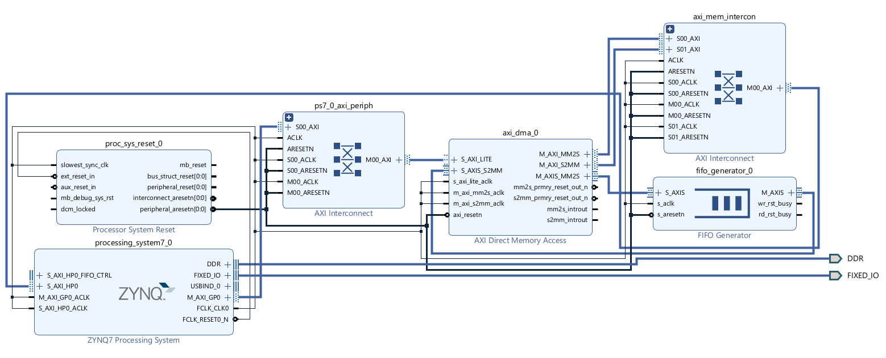
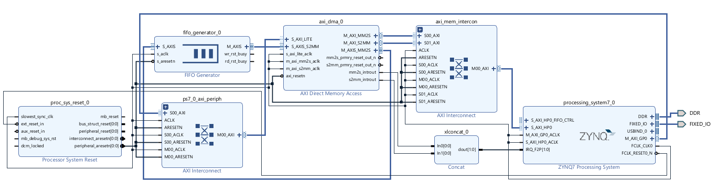

# Example Loopback project on Zynq-7000 SoC

This project is the simplest test to know that you configured the DMA correctly: just send data to it and get them back. The only thing that resides in the PL along the DMA controller is a FIFO that connects the input stream to the output stream.

This project was developed on a Windows 11 machine with Vivado and Vitis 22.2. The SoC used is the Digilent [Cora Z7S](https://digilent.com/reference/programmable-logic/cora-z7/start?srsltid=AfmBOop1WbKCwSRevTnR1wBTyK89O_web_5MYcPAdbv43u49Iq8fW7U7) FPGA development board.

This repository contains the vivdao project that generated the hardware description files and the Vitis workspace with the software used. I decided not to leave the entire xilinx software support libraries out of this repository (even if they make it very large) so that the viewer of the repository can test that if she follows the steps I describe in the below section then similar project structures will emerge.

## VIVADO side

### Block Design for PS with DMA in Polling Mode

This first design is included in the [DMA_Loopback](./designs/vivado_2022.2/DMA_Loopback/) folder and it sets up the Zynq processing system to work in a polling mode; the PS polls the DMA engine state to realize transfers - no interrupt service routines are used.

This is how the block design [design_1](./designs/vivado_2022.2/DMA_Loopback/DMA_Loopback.gen/sources_1/bd/design_1/) was made.

1. insert a Zynq PS
  - in PS-PL configuration activate an AXI HP interface (I chose 32 bit data width)
  - from the schematic it has know that you neeed the following AXI interfaces:
    - a 32b AXI Master Port (usually the first one is `M_AXI_GP0`) which will connect and control the DMA via AXI interconnect
    - a high performance AXI Slave interface that as you see connects to the DDR memory controler (usually first one is `S_AXI_HP0`)
    - **do not run connection automation yet but you have to run board automation**
2. add a processing system reset
3. add an AXI DMA (the simple one)
  - make sure you have same stream data width as you specified above, both on the read and write channels
  - if you intent on having continuous data in memory you can disable scatter gather engine
  - careful with the buffer length because I had problems later with vitis - the number of valid bits it says, when raised as an exponent of two, must produce a number larger to the length of the buffer you want to transfer from the PS. _It is best to just leave it at 14_.
4. run connection automation and block automation. This will most likely insert an AXI interconnect that you had not inserted. Beware the following:
  - the AXI Master interface in the Zynq must go throught an AXI _peripheral_ interconnect and connect to the DMA `S_AXI_LITE` port. This is the interface from which the PS has access and configures the DMA controller
  - the DMA controler master control ports, which are `M_AXI_MM2S` and `M_AXI_S2MM` must got through an AXI _memory_ interconnect and connect to the high performance AXI slave interface in the Zynq system. This interface is what makes the PS and the DMA controller talk to the DDR memory controler. If you had scatter gather then it should have its own master port in the DMA peripheral and be connected in a similar fashion.
5. add a FIFO generator
  - make it AXI Stream and use common clock
  - `TDATA NUM BYTES` must be 4 bytes for 32 bit data
  - You want no `TUSER` so add 0 to `TUSER WIDTH`
  - Add `TLAST`
  - Connect the reset and the clock
6. Connect the FIFO to the DMA 
  - Connect the SLAVE interface S_AXIS of the FIFO to  M_AXIS_MM2S interface on the DMA block.
  - Connect the master M_AXIS interface of the FIFO to the S_AXIS_S2MM in the DMA
7. make sure you have connected the clocks to the clock line and the resets to the reset line
  - **WARNING**: *AXI reset is **active low***
8. Run validation (checkbox)
9. in the address editor there are some DMA addresses but nothing you cannot do on Vitis
10. create the HDL wrapper and generate bitstream
11. export hardware as .xsa file (include bitstream)

For reference the Block Design should look like the following picture:

_The final exported hardware had the following three versions:_
+ _[version 1](./designs/vivado_2022.2/DMA_Loopback/DMA_Loopback_v1.xsa) had left out the Zynq slave HP to DMA master interfaces_
+ _[version 2](./designs/vivado_2022.2/DMA_Loopback/DMA_Loopback_v2.xsa) had wrong DMA buffer length_
+ _[version 3](./designs/vivado_2022.2/DMA_Loopback/DMA_Loopback_v3.xsa) has DMA buffer length at 14_

###  Block Design for PS with DMA in Interrupt Mode

This design is included in the [DMA_Loopback_IRQ](./designs/vivado_2022.2/DMA_Loopback_IRQ/) folder. It builds on top of the previous design and it enriches the system so that the DMA operation is managed via interrupt requests (IRQs).

Assuming you have the same design as above do these additional steps to end up in a block design like [design_1](./designs/vivado_2022.2/DMA_Loopback_IRQ/DMA_Loopback_IRQ.gen/sources_1/bd/design_1/).

1. Open the Zynq PS
  - go to Interrupts
  - enable fabric interrupts
  - in the drop down menu in the hierarchy and in the PL-PS Interrupt ports tick the IRQ_F2P (FPGA to Processing System)
  - click OK
2. the DMA engine generated two interrupt signals so we need to use a concat block
  - add a concat block
  - connect its output to the `IRQ_F2P` in the PS
  - connect its two inputs to the `mm2s_introut` and `s2mm_introut` in the DMA block.
3. Your design is ready so follow steps 8 - 11 of the previous section and give your xsa a different name

For reference the updated block design should look like this:

 

## Vitis Side

### PS DMA Application in Polling Mode

This is the description of the DMA_Loopback (it doesn't have to do with any folders that begins with 'DMA_Loopback_IRQ') application. It has hardware platform generated from the [DMA_Loopback](./designs/vivado_2022.2/DMA_Loopback/) vivado project and it is about a software application of DMA communication in polling mode

- you will probably need to configure the workspace a bit, I do not know how you left Vitis the last time. Make it point to the [vitis folder](./designs/vitis_2022.2/)
- create 'Application Project'
- Create new platform tab go and find your .xsa - make sure generate boot components is ticked
- go over the other tabs that are somewhat pre-configured. I will try to go with the empty template
- Just a reminder of the folders:
  - [`DMA_Loopback_v1`](./designs/vitis_2022.2/DMA_Loopback_v1/) is the hardware platform and you can find addresses and hardware info, and with right click even change the .xsa
  - [`DMA_Loopback`](./designs/vitis_2022.2/DMA_Loopback/) is the software source folder where you write your code
  - [`DMA_Loopback_System`](./designs/vitis_2022.2/DMA_Loopback_system/) in Vitis seems to encompass both the other two directories and in VSCode it seems seperate. Either way it has project info.
- The empty template does not even have a `main.c` so we create it in the [`source`](./designs/vitis_2022.2/DMA_Loopback/src/) folder. All includes will be inserted by hand
- you can follow the comments on the code to know what to do

This is the main application but then I added some more to test some concepts using the same hardware platform. This means that the final [.xsa](./designs/vivado_2022.2/DMA_Loopback/DMA_Loopback_v3.xsa) used with the generated hardware platform ([`DMA_Loopback_v1`](./designs/vitis_2022.2/DMA_Loopback_v1/)) is the same but on top I add more applications (with the blue boxes like you insert the examples).

**_Using different data types in the transfer_**

The system application [`DMA_Loopback_datatypes`](./designs/vitis_2022.2/DMA_Loopback_datatypes/) has the same functionality as the above system application but this one utilizes single-precision floating point numbers (`float` types). An important difference is that `printf` is used for debugging instead of the lightweight `xil_printf` tha has no support for `float` datatypes.

**_Memory allocation with malloc_**

This system application [`DMA_Loopback_memorysafe`](./designs/vitis_2022.2/DMA_Loopback_memorysafe/) has the same functionality as the previous examples but makes no use of defines to access DDR memory. Instead it relies on the fact that in the [linker script](./designs/vitis_2022.2/DMA_Loopback_memorysafe/src/lscript.ld) the heap memory base is the beginning of the DDR memory. Thus every `malloc` or `calloc` call allocates memory on the heap, so as to say *dynamically in the DDR* which is incredibly useful in large programs, where we wish to avoid memory conflicts.

### PS DMA Application in Interrupt Mode
  
This is the description of the DMA_Loopback_IRQ (all folders that begin with 'DMA_Loopback_IRQ') application. It has hardware platform generated from the [DMA_Loopback_IRQ](./designs/vivado_2022.2/DMA_Loopback_IRQ/) vivado project and it is about a software application of DMA communication in interrupt mode.

All that was described above for the folder structure are true. The applications were developed in the same Vitis workspace, in which the new hardware platform was included. Now thaty the project has multiple hardware platforms it is important to be careful what to target in the builds and in the debug sessions. The hardware platform now is [DMA_Loopback_IRQ](./designs/vitis_2022.2/DMA_Loopback_IRQ/) and then system applications that choose this as a hardware platform and all begin with "DMA_Loopback_IRQ" are added on top.

**_Application based on example_**

[DMA_Loopback_IRQ_example](./designs/vitis_2022.2/DMA_Loopback_IRQ_example/) is an application that it is based on the provided example of Xilinx (imported from the BSP settings) called "xaxidma_example_simple_intr"

**_Memory safe application using malloc_**

Like in the polling example, dynamic memory allocation using `malloc` happens on the heap which resides in the DDR. This example is not dependant on defines from `xparameters.h`. This is showcased in the [DMA_Loopback_IRQ_memorysafe](./designs/vitis_2022.2/DMA_Loopback_IRQ_memorysafe/).

### Tips
- some files that are better to check out on Vitis cause they are GUI based, even though you can do mass changes on them here using VIM.
- when you create files in vitis it automatically fills in some boiler plate code
- in vitis you can choose what to build. Especially after a clean you can either build the platform or the application
- if you want to add some examples to help you go to the gui from the [`DMA_Loopback.prj`](./designs/vitis_2022.2/DMA_Loopback/DMA_Loopback.prj) and choose "Navigate to BSP Settings". This opens the [`platform.spr`](./designs/vitis_2022.2/DMA_Loopback_v1/platform.spr) GUI and in the box belwo it shows all available and initialized drivers, where you can import examples.